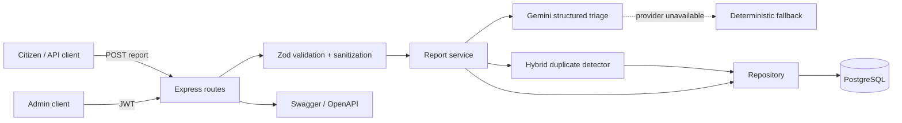

# CrisisDesk AI

CrisisDesk AI is a backend-only emergency and public-service triage API built for the AI & API Hackathon 2026. It accepts Bangla or English citizen reports, validates and sanitizes them, classifies urgency and category with Gemini, detects likely duplicates, stores the result in PostgreSQL, and exposes authenticated workflow management plus analytics APIs.

## Feature checklist

- All six required report endpoints, including filterable list and summary analytics
- Gemini structured-output classification, summaries, recommended actions, and confidence scores
- Safe deterministic fallback for local development; strict AI mode for deployment and judging
- Hybrid duplicate detection using description, location, category, and a seven-day active-report window
- PostgreSQL persistence through Prisma with enums, indexes, migration, and seed data
- Zod request validation, Unicode-aware sanitization, size limits, and structured errors
- Bangla and English input support
- JWT authentication for admin PATCH and DELETE operations
- API rate limiting, Helmet, CORS, compression, and body limits
- Interactive Swagger UI and downloadable OpenAPI document
- Dockerfile, Docker Compose, integration tests, and graceful shutdown

## Architecture



The HTTP layer only handles transport. `ReportService` coordinates the use case, `TriageService` hides the external AI provider, `DuplicateService` owns similarity scoring, and `ReportRepository` isolates persistence. Tests replace the database and AI behind those interfaces, while production uses Prisma and Gemini.

## Quick start with Docker

Prerequisites: Docker and Docker Compose.

```bash
cp .env.example .env
# Set a strong JWT_SECRET, ADMIN_PASSWORD, and optional GEMINI_API_KEY in .env
docker compose up --build
```

Open:

- API: `http://localhost:4000`
- Swagger UI: `http://localhost:4000/docs`
- OpenAPI JSON: `http://localhost:4000/openapi.json`
- Health check: `http://localhost:4000/health`

PostgreSQL data is stored in the `postgres_data` Docker volume. The API waits for the database health check and automatically applies committed migrations.

## Local development

Prerequisites: Node.js 20+ and PostgreSQL 16+.

```bash
npm install
cp .env.example .env
npm run prisma:generate
npm run prisma:migrate
npm run db:seed
npm run dev
```

The seed is idempotent: it upserts the admin identified by `ADMIN_EMAIL` and stores only a bcrypt hash of `ADMIN_PASSWORD`. Running it again safely rotates that admin's password.

To seed the requested administrator, set these values in `.env` before running `npm run db:seed`:

```bash
ADMIN_EMAIL=admin@crisisdesk.app
ADMIN_PASSWORD=<the-admin-password>
```

### AI modes

Set `GEMINI_API_KEY` to use Google's Gemini API. The API sends the report description, location, and declared language to Gemini and requires a structured JSON result whose category, urgency, string lengths, and confidence are validated again with Zod before storage. The default model is `gemini-2.5-flash-lite`, configurable through `GEMINI_MODEL`.

- `AI_REQUIRED=false` (default): Gemini is used when configured; a local deterministic classifier handles a missing key or provider outage. This keeps development and tests available offline. Stored reports identify the actual provider in `aiProvider`.
- `AI_REQUIRED=true`: startup fails without a key and report creation returns `503` if Gemini fails. Use this for judging or production when every classification must be AI-generated.

Create a key in Google AI Studio, then add it only to `.env` or your deployment secret store. Never commit it.

## API guide

### Submit a report

```bash
curl -X POST http://localhost:4000/api/reports \
  -H 'Content-Type: application/json' \
  -d '{
    "name": "Rahim",
    "contact": "017xxxxxxxx",
    "location": "Sylhet Bondor Bazar",
    "description": "There is a fire near a shop and people are trapped.",
    "language": "en"
  }'
```

The response includes all stored triage fields, including `possibleDuplicate`, `matchedReportId`, and `duplicateScore`.

### Filter and search

```bash
curl 'http://localhost:4000/api/reports?category=fire&urgency=critical&status=pending&search=shop&page=1&limit=20'
```

Available filters: `category`, `urgency`, `status`, `search`, `from`, and `to`. Dates must be ISO 8601 timestamps with an offset, for example `2026-07-01T00:00:00Z`.

### Admin authentication and status update

```bash
TOKEN=$(curl -s -X POST http://localhost:4000/api/auth/login \
  -H 'Content-Type: application/json' \
  -d '{"email":"admin@crisisdesk.app","password":"your-seeded-password"}' | jq -r .token)

curl -X PATCH http://localhost:4000/api/reports/REPORT_ID/status \
  -H "Authorization: Bearer $TOKEN" \
  -H 'Content-Type: application/json' \
  -d '{"status":"assigned"}'
```

Allowed statuses: `pending`, `in_review`, `assigned`, `resolved`, and `rejected`.

| Method | Endpoint | Auth | Purpose |
| --- | --- | --- | --- |
| POST | `/api/reports` | Public | Validate, classify, deduplicate, and store a report |
| GET | `/api/reports` | Public | Filter, search, and paginate reports |
| GET | `/api/reports/stats/summary` | Public | Aggregate totals and breakdowns |
| GET | `/api/reports/:id` | Public | Get report details |
| PATCH | `/api/reports/:id/status` | Admin JWT | Update workflow status |
| DELETE | `/api/reports/:id` | Admin JWT | Delete a report |
| POST | `/api/auth/login` | Public | Verify a seeded database admin and obtain a JWT |

For complete request/response contracts and live execution, use Swagger UI at `/docs`.

## Duplicate detection

For every new report, the API considers up to 250 unresolved or unrejected reports in the same AI-assigned category from the previous seven days. The weighted score is:

```text
45% description similarity + 35% location similarity + 20% category match
```

Description and location similarity combine Unicode-aware token Jaccard and character-bigram Jaccard scores, which work with both Bangla and English. Scores at or above `DUPLICATE_THRESHOLD` (default `0.62`) set `possibleDuplicate=true`; the best match ID and score are stored for auditability. It is a triage hint, not an automatic rejection.

## Validation and errors

All request objects reject unknown fields. Text is normalized with Unicode NFKC, control characters are removed, repeated spacing is collapsed, and field lengths are limited before business logic runs.

```json
{
  "success": false,
  "code": "VALIDATION_ERROR",
  "message": "The request contains invalid data.",
  "errors": [
    { "field": "description", "message": "String must contain at least 1 character(s)" }
  ]
}
```

Errors use appropriate HTTP codes: `400` validation, `401` authentication, `404` missing resource, `409` database conflict, `429` rate limit, `503` strict AI failure, and `500` unexpected failure. Internal stack traces are never sent to clients.

## Testing

```bash
npm run typecheck
npm test
npm run test:coverage
```

The integration suite exercises submission, sanitization, validation, duplicate matching, four filter types, detail/404 behavior, authentication, admin status changes, deletion, analytics route precedence, and Swagger exposure. It uses in-memory repository and AI adapters; database behavior is covered by Prisma schema generation and migrations.

## Deployment

For Render, Railway, Fly.io, or a similar service:

1. Provision PostgreSQL and set `DATABASE_URL`.
2. Set `GEMINI_API_KEY`, `AI_REQUIRED=true`, a random 32+ character `JWT_SECRET`, and strong admin credentials.
3. Build with `npm ci && npm run build`.
4. Start with `npm run prisma:deploy && npm start`.
5. Point the health check to `/health`, then verify `/docs` and submit a real AI-classified test report.

The included Dockerfile uses a multi-stage build and runs as the unprivileged `node` user.

## Open-source credits

This project uses Express, TypeScript, Prisma, PostgreSQL, Zod, Google Gen AI SDK, Swagger UI Express, JSON Web Token, bcrypt.js, express-rate-limit, Helmet, CORS, compression, Morgan, Vitest, and Supertest. These libraries and their respective licenses are credited here as required by the hackathon rules. Core architecture, triage orchestration, duplicate scoring, validation policy, and API design are implemented in this repository.

## Submission checklist

- [ ] Create a new public GitHub repository and push this code during the allowed round
- [ ] Deploy the API and verify the live `/health`, `/docs`, and report submission endpoints
- [ ] Record a Loom video showing the architecture diagram, Swagger demo, database record, duplicate match, admin status update, and analytics
- [ ] Add the public repository, deployment URL, and Loom URL to the final submission form
- [ ] Rotate all demonstration credentials before publishing
